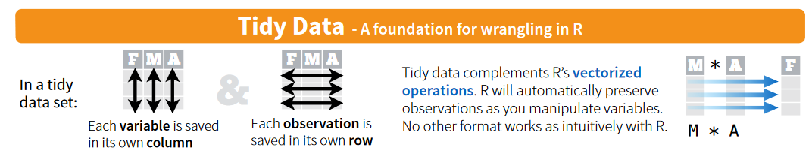
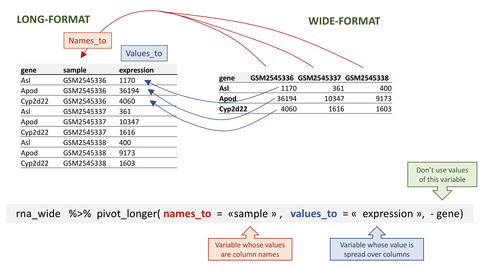
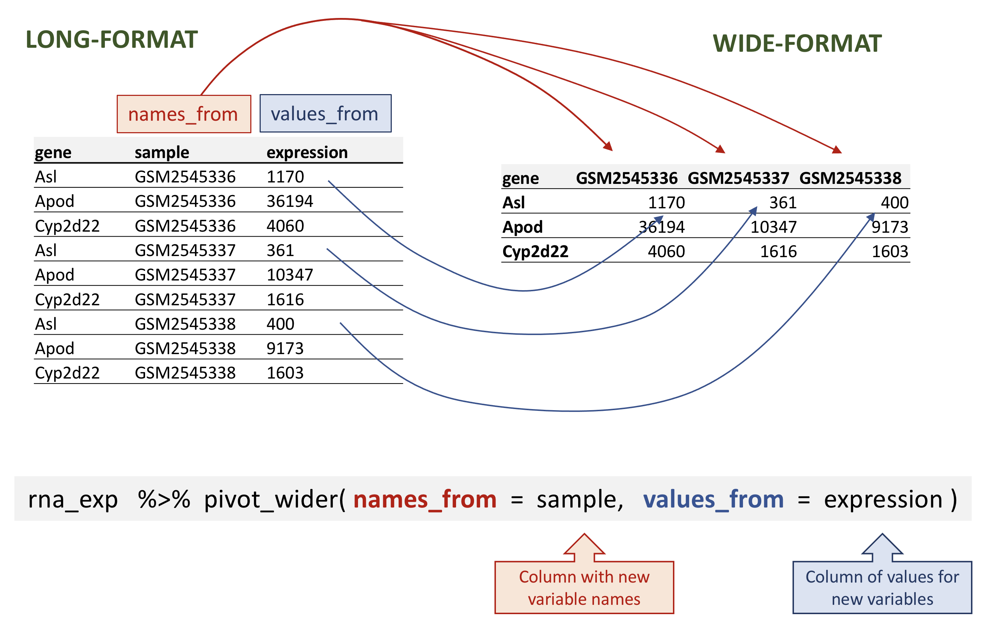

```{r, child="_setup.qmd"}
```

## Before we begin

-   If you are not using Workbench, please install the following packages:

```{r}
#| eval: false
#| echo: true
install.packages("tidyverse")
```

-   The command will install a large set of packages that are designed to work together, including ggplot2.

And load the package
```{r}
#| echo: true
library(tidyverse)
```


## Credit

-   This presentation is heavily influenced by Rafael Irizarry's book [Introduction to Data Science](https://rafalab.dfci.harvard.edu/dsbook) and his corresponding course on EdX.
-   It also draws on material from previous MPI R courses given by Devon Ryan and David Koppstein.
-   Updated with the Software Carpentry course "*Introduction to data analysis with R and Bioconductor*"

{width="150"}
{width="150"}
{width="150"}

::: footer
<https://www.edx.org/bio/rafael-irizarry>
<https://carpentries-incubator.github.io/bioc-intro/30-dplyr.html>
:::

## Following along

- For each module, please create a separate R script and type in and execute the commands that are to follow along. 

- The code from some slides depends on the previous slides! 

- You can execute each line individually using Command-Enter on Mac, alt-Enter on Workbench.

## Our example dataset
Gender matched eight week old C57BL/6 mice were inoculated saline or with Influenza A (Puerto Rico/8/34; PR8, 1.0 HAU) by intranasal route and transcriptomic changes
in the cerebellum and spinal cord tissues were evaluated by RNA-seq (Hiseq-2500 100bp PE-reads) at days 0 (non-infected), 4 and 8.

But for this session, we'll use `https://raw.githubusercontent.com/maxplanck-ie/Rintro/2024.04/qmd/data/rnaseq_counts_wide.csv`
which contains a table for gene expression (1474 genes) per sample (22 samples)

::: footer
Blackmore S, et al. *Influenza infection triggers disease in a genetic model of experimental autoimmune encephalomyelitis*.PNAS 2017,114(30):E6107-E6116. PMID: 28696309
:::

## Data Import in the Tidyverse

The first step for any analysis is importing the data into a machine-readable format. The tidyverse offers the `readr::` and `readxl::` packages.

Note:

- most data can be easy to import when it's properly formatted in a text format

- MS Excel files can be read and/or write but **should be avoided**

## Table formats {auto-animate="true"}

CSV (*comma separated values*)
```
sample,sex,age,treatment,response
A001,M,8,KO,5200
A002,M,4,WT,4430
A003,F,4,KO,344
B001,F,6,WT,2328
```

TSV (*tab separated values*)
```
sample\tsex\tage\ttreatment\tresponse
A001\tM\t8\tKO\t5200
A002\tM\t4\tWT\t4430
A003\tF\t4\tKO\t344
B001\tF\t6t\tWT\t2328
```

## `readr::` {auto-animate="true"}

-   `readr::` is the Tidyverse library for reading data from text formats.
-   `read_csv()`, `read_tsv()`, `read_table()`, and `read_delim()` are some of the functions provided
-   `read_csv2()` allows for reading of European-style CSV files (e.g. using `;`)

::: footer
<https://readr.tidyverse.org/>
:::

## `readr::` in action {auto-animate="true"}

Example commands, don't run
```{r}
#| echo: true
#| eval: false

# read file in CSV format, file is in working directory
dat = read_csv("file.csv")

# read file using full path, file is anywhere in the filesystem
dat = read_csv("/full/path/to/file.csv")

# read file using URL, file is anywhere in the internet
dat = read_csv("https://server.com/region/file.csv")
```

## `readr::` in action {auto-animate="true"}

```{r}
#| echo: true
rna_file = "https://raw.githubusercontent.com/maxplanck-ie/Rintro/2024.04/qmd/data/rnaseq_counts_wide.csv"

rna = read_csv(rna_file)

# What is this "*rna*"?
rna 
```


## What is a tibble?

-   Tibbles are like data frames, but more modern, and are built for the Tidyverse
-   The interface is the same, using e.g. `$` for columns
-   Tibbles can contain more complex objects than just strings, numbers, or booleans, like lists or functions
-   Tibbles can be grouped
-   You can see the types of each column in a tibble

## What is Tidy Data? 

- In tidy data, each row is an observation and each column is a different variable (*long-format*). 
- In wide data, each row contains several observations, and the columns contain values (*wide-format*). 



## Hands on {auto-animate="true"}

Get the basic statistics for each sample in `rna`

Which sample has the highest mean expression?


## Dplyr in action - `pivot_longer()` {auto-animate="true"}

To transform the data in a long-format we use `pivot_longer()`, it takes as inputs:

1. the `data` to be transformed;
2. the `names_to` the new column name we wish to create and populate with the current column names;
3. the `values_to` the new column name we wish to create and populate with current values;
4. the names of the columns to be used to populate the `names_to` and `values_to` variables (or to drop with `-`).

## Dplyr in action - `pivot_longer()` {auto-animate="true"}

```{r}
#| echo: true

rna_long = pivot_longer(
                 rna,
                 names_to = "sample",
                 values_to = "expression",
                 -gene)
rna_long
```

## Dplyr in action - `pivot_longer()` {auto-animate="true"}



## Dplyr in action - `pivot_longer()` {auto-animate="true"}

Column selection can be defined with patterns

```{r}
#| echo: true

rna_long2 = pivot_longer(
                 rna,
                 names_to = "sample",
                 values_to = "expression",
                 cols = starts_with("GSM"))
rna_long2
```

## Dplyr in action - `pivot_longer()` {auto-animate="true"}

Column selection can be also defined with ranges

```{r}
#| echo: true

rna_long3 = pivot_longer(
                 rna, 
                 names_to = "sample",
                 values_to = "expression",
                 GSM2545336:GSM2545380)
rna_long3
```

## Dplyr in action - `pivot_wider()` {auto-animate="true"}

The inverse operation is `pivot_wider()` can transform long-format to wide-format.

It takes three main arguments:

1. the `data` to be transformed

2. the `names_from` are the column whose values will become new column names

3. the `values_from` are the column whose values will fill the new columns

## Dplyr in action - `pivot_wider()` {auto-animate="true"}

```{r}
#| echo: true

rna_wide = pivot_wider(
                rna_long,
                names_from = sample,
                values_from = expression)
rna_wide

```

## Dplyr in action - `pivot_wider()` {auto-animate="true"}



## Dplyr in action - `pivot_wider()` {auto-animate="true"}

By default, missing values will be converted to `NA`, we can change it with `values_fill`

```{r}
#| echo: true

rna_wide_noNAs = pivot_wider(
                      rna_long,
                      names_from = sample,
                      values_from = expression,
                      values_fill = 0)
rna_wide_noNAs
```

## Dplyr in action - `write_csv` {auto-animate="true"}

Finally, we could need to save our data as a new file for later use or sharing, we can use `write_csv()`

```{r}
#| echo: true
#| eval: false

write_csv(rna_wide_noNAs, file = "rna_wide.csv")

```

## `readxl::` {auto-animate="true"}

-   `readxl::` is the Tidyverse library for reading data from Excel formats
-   `read_excel()`, `read_xls()` and `read_xlsx()` are some of the functions provided
-   The `excel_sheets()` function yields the names of the sheets in the Excel file 
-   But please, **don't use Excel**

## Any questions?

We will next talk about how to manipulate data in data frames/tibbles using the Tidyverse.
