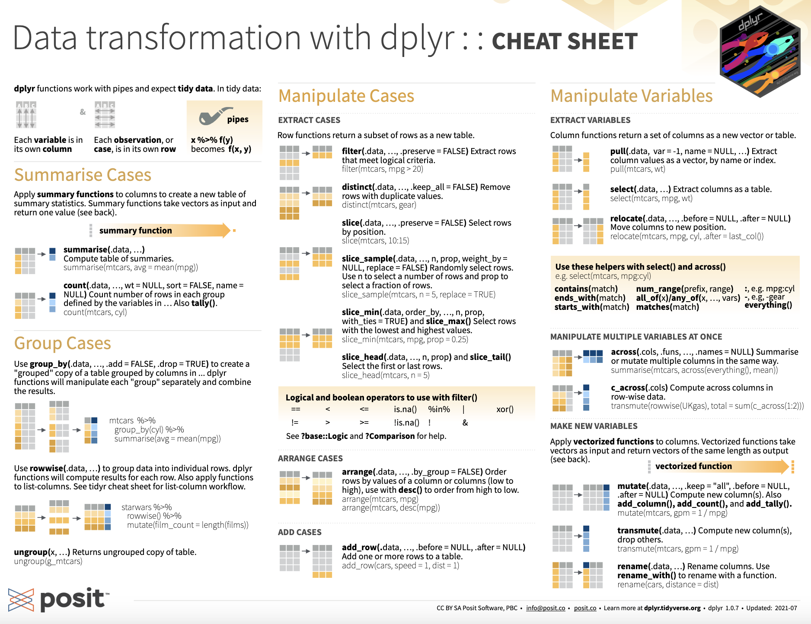

```{r, child="_setup.qmd"}
```

## Introduction to Dplyr {auto-animate="true"}

Dplyr uses a functions that act as verbs to transform data frames in ways to facilitate data analysis.

The six main verbs are:

-   `mutate()`: creates new columns
-   `filter()`: filters rows based on criteria
-   `select()`: selects columns
-   `summarize()`: creates summary statistics
-   `group_by()`: analysis on subsets based on a column
-   `arrange()`: sorts rows

## Dplyr in action {auto-animate="true"}

`rnaseq.csv` is the long-format for the mouse influenza experiment. 

```{r}
#| echo: true
library(tidyverse)

rnaseq_file = "https://raw.githubusercontent.com/maxplanck-ie/Rintro/2024.04/qmd/data/rnaseq.csv"

rna = read_csv(rnaseq_file)
```
## Dplyr in action {auto-animate="true"}

Contains: gene, sample, expression, organism, age, sex, infection, strain, time, tissue, mouse, 
ENTREZID, product, ensembl_gene_id, external_synonym, chromosome_name,
gene_biotype, phenotype_description, hsapiens_homolog_associated_gene_name

```{r}
#| echo: true
rna
```

## Dplyr in action - `select()` {auto-animate="true"}

Syntax: `select(data, col1, col2, col3, ...)`
```{r}
#| echo: true

select(rna, gene, sample, tissue, expression)
```

## Dplyr in action - `select()` {auto-animate="true"}

Column exclusion can be defined with `-`
```{r}
#| echo: true

select(rna, -tissue, -strain, -organism)
```

## Hands on

- Select `gene, ensembl_gene_id, hsapiens_homolog_associated_gene_name`

- Select `gene, gene_biotype, phenotype_description`

## Dplyr in action - `filter()` {auto-animate="true"}

Syntax: `filter(data, filters)`

Comparisons: `== > >= < <=` 
```{r}
#| echo: true

filter(rna, sex == "Male")
```

## Dplyr in action - `filter()` {auto-animate="true"}

Logical operators: `& | ! xor()`
```{r}
#| echo: true

# get data which sex is Male AND infection status is NonInfected
filter(rna, sex == "Male" & infection == "NonInfected")

```
## Dplyr in action - `filter()` {auto-animate="true"}

Multiple filters can be used with `,`
```{r}
#| echo: true

# get data which sex is Male AND infection status is NonInfected
filter(rna, sex == "Male", infection == "NonInfected")
```

## Hands on {auto-animate="true"}

- Filter data for `females` and `infected`

- Filter data for `Cerebellum` in `time 0`


## Dplyr in action - `filter()` {auto-animate="true"}

It can evaluate missing values with `is.na()`
```{r}
#| echo: true

# get data which human ortholog gene is not defined (*NA*) 
filter(rna, is.na(hsapiens_homolog_associated_gene_name))

```

## Dplyr in action - `filter()` {auto-animate="true"}

```{r}
#| echo: true

# get data which human ortholog gene is defined (not *NA*) 
filter(rna, !is.na(hsapiens_homolog_associated_gene_name))

```

## Dplyr in action - Pipes {auto-animate="true"}

What if you want to select and filter? 

For example get `gene, sample, tissue, expression` for `Males`

Option 1. Generate intermediate tables

Option 2. Use nested operations

Option 3. Plumbering with Pipes

## Dplyr in action - Pipes {auto-animate="true"}

Option 1. Generate intermediate tables

```{r}
#| echo: true
#| eval: false

# step 1, filter males
rna2 = filter(rna, sex == "Male")

# step 2, filter columns
rna3 = select(rna2, gene, sample, tissue, expression)
```
Why is this bad?

## Dplyr in action - Pipes {auto-animate="true"}

Option 2. Use nested operations

```{r}
#| echo: true
#| eval: false

rna3 = select(filter(rna, sex == "Male"), gene, sample, tissue, expression)
```

Why is this also bad?

## Dplyr in action - Pipes {auto-animate="true"}

Option 3. Plumbering with Pipes - Yeah!

Is this better?

```{r}
#| echo: true

rna3 = rna %>%
        filter(sex == "Male") %>%
        select(gene, sample, tissue, expression)
rna3
```

Pipes in R look like `%>%` (made available via the magrittr package) or `|>` (through base R)

## Hands on {auto-animate="true"}

Using pipes, subset the `rna` data to keep observations in female mice at time 0, where the gene
has an expression higher than 50000, and retain only the columns `gene`, `sample`, `time`, `expression` and `age`.


## Hands on {auto-animate="true"}

Solution

```{r}
#| echo: true

rna %>%
  filter(expression > 50000, sex == "Female", time == 0 ) %>%
  select(gene, sample, time, expression, sex)
```

## Dplyr in action - `mutate()` {auto-animate="true"}

As frequently we want to add new columns based on existing data, we can expand the tibble with `mutate()`.

In our example, `time` is defined in days, let's add a new column for time in hours (`time_hours`)

```{r}
#| echo: true

rna %>%
  mutate(time_hours = time * 24) %>%
  select(time, time_hours)

```

## Dplyr in action - `mutate()` {auto-animate="true"}

The new columns can be used to generate another columns, for example, adding a time in minutes based on time in hours:
```{r}
#| echo: true

rna %>%
  mutate(time_hours = time * 24,
         time_min = time_hours * 60) %>%
  select(time, time_hours, time_min)

```

## Hands on {auto-animate="true"}

Create a new data frame from the `rna` data that meets the following criteria: 
contains only `gene, chromosome_name, phenotype_description, sample, 
expression`. The expression values should be `log-transformed`. This data 
 must only contain genes located on `sex chromosomes`, associated with a 
`phenotype_description`, and with a `log-expression higher than 5`.

Hint: think about how the commands should be ordered to produce this!

## Hands on {auto-animate="true"}

Solution: 

```{r}
#| echo: true

rna %>%
  filter(chromosome_name == "X" | chromosome_name == "Y") %>%
  filter(!is.na(phenotype_description)) %>%
  mutate(expression_log = log(expression)) %>%
  select(gene, chromosome_name, phenotype_description, sample, expression_log) %>%
  filter(expression_log > 5)

```

## Dplyr in action - `group_by()` {auto-animate="true"}

Data analysis commonly needs to split the data, perfom computations and then combine the results (*split-apply-combine* paradigm)

```{r}
#| echo: true

# group data by 'gene'
# Note the 'Groups: gene [1,474]'
rna %>%
  group_by(gene)

```


## Dplyr in action - `group_by()` {auto-animate="true"}


```{r}
#| echo: true

# group data by 'sample'
# Note the 'Groups: sample [22]'
rna %>%
  group_by(sample)

```


## Dplyr in action - `summarise()` {auto-animate="true"}

After grouping, we can do some computation as `summarise()`

```{r}
#| echo: true

# get average expression per gene
rna %>%
  group_by(gene) %>%
  summarise(mean_expression = mean(expression))

```

## Dplyr in action - `summarise()` {auto-animate="true"}

```{r}
#| echo: true

# get average expression per sample
rna %>%
  group_by(sample) %>%
  summarise(mean_expression = mean(expression))

```

## Dplyr in action - `summarise()` {auto-animate="true"}

Multiple grouping levels

```{r}
#| echo: true

# get average expression per gene + infection + time
rna %>%
  group_by(gene, infection, time) %>%
  summarise(mean_expression = mean(expression))

```

## Dplyr in action - `summarse()` {auto-animate="true"}

Multiple summarise levels

```{r}
#| echo: true

# get average and median expression per gene + infection + time
rna %>%
  group_by(gene, infection, time) %>%
  summarise(mean_expression = mean(expression),
            median_expression = median(expression))

```

## Hands on {auto-animate="true"}

Calculate the mean expression level of gene “Dok3” by timepoints.


## Hands on {auto-animate="true"}

Solution

```{r}
#| echo: true

rna %>%
  filter(gene == "Dok3") %>%
  group_by(time) %>%
  summarise(mean = mean(expression))

```

## Dplyr in action - `count()` {auto-animate="true"}

`count()` summarise the total elements per category

```{r}
#| echo: true

# get counts in infection classes
rna %>%
    count(infection)

```

that is equivalent to:

```{r}
#| echo: true

rna %>%
    group_by(infection) %>%
    summarise(n = n())
```

## Dplyr in action - `count()` {auto-animate="true"}

Counts can be also in multiple levels

```{r}
#| echo: true

rna %>%
    count(infection, time)

```

## Dplyr in action - `arrange()` {auto-animate="true"}

Data can be sorted by column values with `arrange()`

```{r}
#| echo: true

rna %>%
    arrange(gene)

```

## Dplyr in action - `arrange()` {auto-animate="true"}

Default is in ascending order, for descending order

```{r}
#| echo: true

rna %>%
    arrange(desc(gene))

```

## Hands on {auto-animate="true"}

1. How many genes were analysed in each sample?

2. Use group_by() and summarise() to evaluate the sequencing depth (the sum of all counts) in each sample. Which sample has the highest sequencing depth?

3. Pick one sample and evaluate the number of genes by biotype.

4. Identify genes associated with the “abnormal DNA methylation” phenotype description, and calculate their mean expression (in log) at time 0, time 4 and time 8.

## Hands on {auto-animate="true"}

1. How many genes were analysed in each sample?

```{r}
#| echo: true

rna %>%
  count(sample)

```

## Hands on {auto-animate="true"}

2. Use group_by() and summarise() to evaluate the sequencing depth (the sum of all counts) in each sample. Which sample has the highest sequencing depth?


```{r}
#| echo: true

rna %>%
  group_by(sample) %>%
  summarise(seq_depth = sum(expression)) %>%
  arrange(desc(seq_depth))

```

## Hands on {auto-animate="true"}

3. Pick one sample and evaluate the number of genes by biotype.

```{r}
#| echo: true

rna %>%
  filter(sample == "GSM2545336") %>%
  count(gene_biotype) %>%
  arrange(desc(n))

```
## Hands on {auto-animate="true"}

4. Identify genes associated with the “abnormal DNA methylation” phenotype description, and calculate their mean expression (in log) at time 0, time 4 and time 8.

```{r}
#| echo: true

rna %>%
  filter(phenotype_description == "abnormal DNA methylation") %>%
  group_by(gene, time) %>%
  summarise(mean_expression = mean(log(expression))) %>%
  arrange()

```

## The tip of the iceberg


For more, see this handy cheatsheet!

{fig-align="center"}

## Any questions?

Next, we will learn about data visualization techniques with ggplot2.
