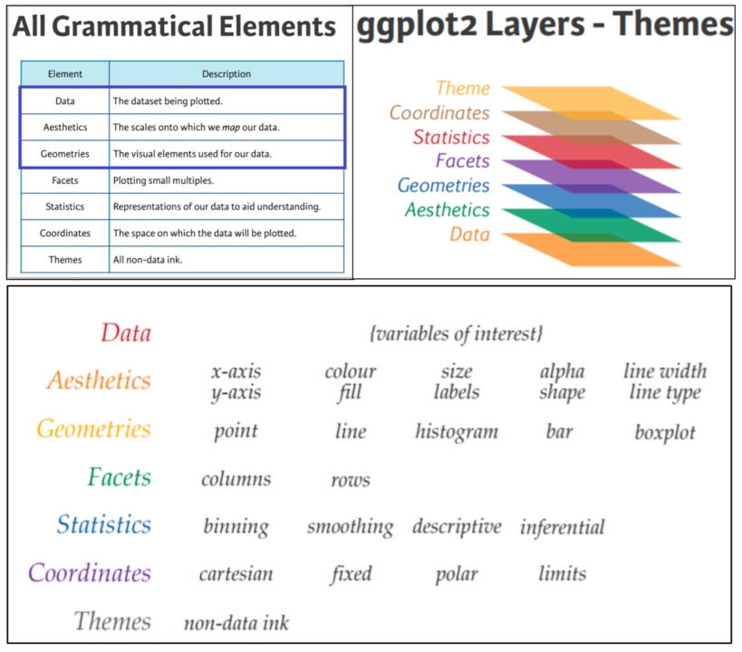
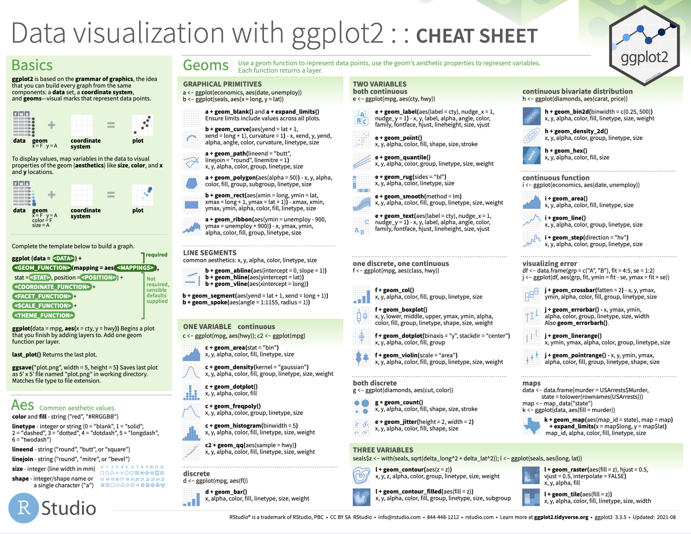
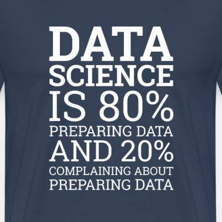

```{r, child="_setup.qmd"}
```

## What is ggplot2?

-   ggplot2 is part of the *tidyverse*, a set of packages created by Hadley Wickham.
-   ggplot2 implements a *grammar of graphics* to enable creation of plots from modular building blocks
-   ggplot2 is designed to work with *tidy data* (we'll get into this later today).

## Graph components {auto-animate="true"}

-   Plots in **ggplot2** consist of 3 main components:
    -   **Data**: The dataset being summarized
    -   **Aesthetic mapping**: Variables mapped to visual cues, such as x-axis and y-axis values and colors
    -   **Geometry**: The type of plot (scatterplot, boxplot, barplot, histogram, qqplot, smooth density, etc.)
    
```
ggplot(data = <DATA>, mapping = aes(<MAPPINGS>)) +  <GEOM_FUNCTION>()
```

## Graph components {auto-animate="true"}

 **geoms**

- `geom_point()` for scatter plots, dot plots, etc.
- `geom_histogram()` for histograms
- `geom_boxplot()` for, well, boxplots!
- `geom_line()` for trend lines, time series, etc.
- *and many more ...*

## Graph components {auto-animate="true"}

-   There are additional components:
    -   Scale
    -   Labels, Title, Legend
    -   Theme/Style

## Graph components {auto-animate="true"}



::: footer
<http://euclid.nmu.edu/~joshthom/Teaching/DAT309/Week1/lecture_2.html>
:::

## Our dataset

Expression matrix from the mouse influenza experiment

```{r}
#| echo: true
library(tidyverse)

rnaseq_file = "https://raw.githubusercontent.com/maxplanck-ie/Rintro/refs/heads/2025.04/qmd/data/rnaseq_counts_wide.csv"

rna = read_csv(rnaseq_file)

rna
```

## Our dataset

Let's plot a MA-like plot for `GSM2545336` vs `GSM2545380`, first, we generate the tibble as:

```{r}
#| echo: true

# log2fc:     M = log2(x/y) = log2(x) - log2(y)
# norm_mean:  A = 1/2 ( log2(x) + log2(y) )
ma_data = rna %>% 
          select(gene, GSM2545336, GSM2545380) %>% 
          mutate(
              norm_mean = ( log2(GSM2545336 + 1) + log2(GSM2545380 + 1) ) / 2,
              log2fc = log2(GSM2545336 + 1) - log2(GSM2545380 + 1)
            ) %>% 
            select(gene, log2fc, norm_mean)
ma_data
```

## ggplot2 in action - `geom_point()`  {auto-animate="true"}

`geom_point()` are basic scatter plots

```{r}
#| echo: true

ggplot(ma_data, aes(x = norm_mean, y = log2fc)) +
  geom_point()
```

## ggplot2 in action - `geom_point()`  {auto-animate="true"}

We can modify graphic elements, for `color`

```{r}
#| echo: true

ggplot(ma_data, aes(x = norm_mean, y = log2fc)) +
  geom_point(color = 'blue')
```

## ggplot2 in action - `geom_point()`  {auto-animate="true"}

Overplotting can be fixed using transparency with `alpha`

```{r}
#| echo: true

ggplot(ma_data, aes(x = norm_mean, y = log2fc)) +
  geom_point(alpha = 0.1)
```

## ggplot2 in action - `geom_point()`  {auto-animate="true"}

Point marks can be changed with `shape`, the numbers are predefined forms

```{r}
#| echo: true

ggplot(ma_data, aes(x = norm_mean, y = log2fc)) +
  geom_point(shape = 3)
```

## ggplot2 in action - `geom_point()`  {auto-animate="true"}

`shape` also accept any char

```{r}
#| echo: true

ggplot(ma_data, aes(x = norm_mean, y = log2fc)) +
  geom_point(shape = '?')
```

## ggplot2 in action - `geom_point()`  {auto-animate="true"}

We can overlap new elements, such as an horizontal line `geom_hline()`

```{r}
#| echo: true

ggplot(ma_data, aes(x = norm_mean, y = log2fc)) +
  geom_point(color = 'blue', alpha = 0.1) +
  geom_hline(yintercept =  1, color = 'red') +
  geom_hline(yintercept = -1, color = 'red')
```

## Hands on {auto-animate="true"}

Generate a similar plot comparing another 2 samples, use red "triangles" as points with a vertical green line in `norm_mean = 5`

## Hands on {auto-animate="true"}
```{r}
#| echo: true

ggplot(ma_data, aes(x = norm_mean, y = log2fc)) +
  geom_point(color = 'red', shape = 17, alpha = 0.1) +
  geom_vline(xintercept = 5, color = 'green')
```


## ggplot2 in action - `geom_histogram()`  {auto-animate="true"}

Histogram of expression values for sample `GSM2545336`

```{r}
#| echo: true

ggplot(rna, aes(x = GSM2545336)) +
  geom_histogram()
```

## ggplot2 in action - `geom_histogram()`  {auto-animate="true"}

We can adjust the histogram `bins`

```{r}
#| echo: true

ggplot(rna, aes(x = GSM2545336)) +
  geom_histogram(bins = 50)

```

## ggplot2 in action - `geom_histogram()`  {auto-animate="true"}

We can use a variable to store a template

```{r}
#| echo: true

# Assign plot to a variable
hist_plot = ggplot(rna, aes(x = GSM2545336))
# Draw the plot
hist_plot + geom_histogram(bins = 100, color = 'blue')

```

## Hands on {auto-animate="true"}

Create a new histogram for another sample values but in log2 scale

## Hands on {auto-animate="true"}

```{r}
#| echo: true
hist_plot = ggplot(rna, aes(x = log2(GSM2545336 + 1)))
hist_plot + geom_histogram(bins = 100, color = 'blue')

```
## New dataset

`rnaseq.csv` is the long-format for the mouse influenza experiment. Let's add a log2-expression column

```{r}
#| echo: true
rnaseq_file = "https://raw.githubusercontent.com/maxplanck-ie/Rintro/refs/heads/2025.04/qmd/data/rnaseq.csv"
rna_data = read_csv(rnaseq_file)
rna_long = rna_data %>% 
           mutate(expression_log = log2(expression + 1))
rna_long
```

## ggplot2 in action - `geom_boxplot()`  {auto-animate="true"}

Boxplots are good to visualize distributions, let's see gene log2-expression over samples

```{r}
#| echo: true

ggplot(rna_long, aes(y = expression_log, x = sample)) +
  geom_boxplot()

```

## ggplot2 in action - `geom_boxplot()`  {auto-animate="true"}

We can add the points over the boxplot with `geom_jitter()`

```{r}
#| echo: true

ggplot(rna_long, aes(y = expression_log, x = sample)) +
  geom_jitter(alpha = 0.2, color = "tomato") +
  geom_boxplot(alpha = 0)

```


## ggplot2 in action - `geom_boxplot()`  {auto-animate="true"}

I can't read the labels!! `theme` can modify the axis labels

```{r}
#| echo: true

ggplot(rna_long, aes(y = expression_log, x = sample)) +
  geom_jitter(alpha = 0.2, color = "tomato") +
  geom_boxplot(alpha = 0) +
  theme(axis.text.x = element_text(angle = 90,  hjust = 0.5, vjust = 0.5))

```

## ggplot2 in action - `geom_boxplot()`  {auto-animate="true"}

Can we color each sample per time point? Sure ...

```{r}
#| echo: true

# time as integer
ggplot(rna_long, aes(y = expression_log, x = sample)) +
  geom_jitter(alpha = 0.2, aes(color = time)) +
  geom_boxplot(alpha = 0) +
  theme(axis.text.x = element_text(angle = 90,  hjust = 0.5, vjust = 0.5))
  
```

Is this what we want?

## ggplot2 in action - `geom_boxplot()`  {auto-animate="true"}

Can we color each sample per time point? Sure ...

```{r}
#| echo: true

# time as factor
ggplot(rna_long, aes(y = expression_log, x = sample)) +
  geom_jitter(alpha = 0.2, aes(color = as.factor(time))) +
  geom_boxplot(alpha = 0) +
  theme(axis.text.x = element_text(angle = 90,  hjust = 0.5, vjust = 0.5))

```
Better ...

## ggplot2 in action - `facet_wrap()`  {auto-animate="true"}

We can plot multiple elements in a single plot separately with `facet_wrap()`

```{r}
#| echo: true

ggplot(rna_long,aes(x = expression_log)) +
  geom_histogram(bins = 50) +
  facet_wrap(~ sample)

```

## ggplot2 in action - `facet_wrap()`  {auto-animate="true"}

By default, all scales are the same, to avoid this:

```{r}
#| echo: true

ggplot(rna_long, aes(x = expression_log)) +
  geom_histogram(bins = 50) +
  facet_wrap(~ sample, scales = "free_y")

```

## ggplot2 in action - `theme_bw()`  {auto-animate="true"}

`ggplot2` supports themes such as `theme_bw()`

```{r}
#| echo: true

ggplot(rna_long, aes(x = expression_log)) + 
  geom_histogram(bins = 50) +
  facet_wrap(~ sample, scales = "free_y") +
  theme_bw() +
  theme(panel.grid = element_blank())
  
```

::: footer
<https://ggplot2.tidyverse.org/reference/ggtheme.html>
:::

## ggplot2 in action - `ggsave()`  {auto-animate="true"}

At the end, we would like to save our gorgeous plot, we can use `ggsave()`.

```{r}
#| echo: true
#| eval: false

my_plot = ggplot(rna_long, aes(x = expression_log)) +
          geom_histogram(bins = 50) +
          facet_wrap(~ sample, scales = "free_y") +
          theme_bw() +
          theme(panel.grid = element_blank())

ggsave("samples_expr_histograms.png", 
        my_plot,
        width = 15,
        height = 10)
  
```


## Tip of the iceberg

See this handy cheatsheet for lots more!

{fig-align="center" width="600"}

::: footer
<https://github.com/rstudio/cheatsheets/blob/main/data-visualization.pdf>
:::

## Any questions?



