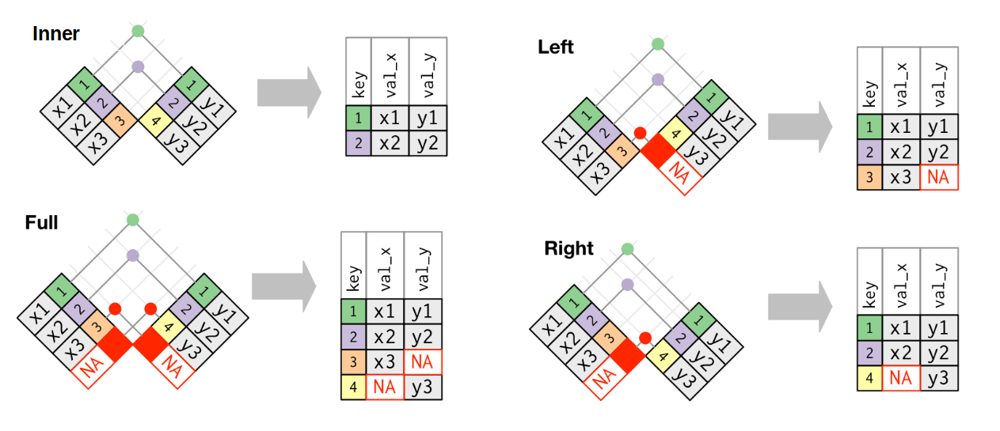

```{r, child="_setup.qmd"}
```

## Our dataset

```{r}
#| echo: true
library(tidyverse)

rnaseq_file = "https://raw.githubusercontent.com/maxplanck-ie/Rintro/2024.04/qmd/data/rnaseq.csv"

rna = read_csv(rnaseq_file) 

```


## Dplyr in action - combining tables {auto-animate="true"}

Dplyr can also merge tables with the basic table operations:

1. An `inner_join` keeps observations that are present in both tables

2. A `left_join` keeps observations that are present in the left (first) table, dropping those that are only present in the other

3. A `right_join` keeps observations that are present in the right (second) table, dropping those that are only present in the other

4. A `full_join` keeps all observations

## Dplyr in action - combining tables {auto-animate="true"}



::: footer
<https://carpentries-incubator.github.io/bioc-intro/30-dplyr.html>
:::

## Dplyr in action - combining tables {auto-animate="true"}

As an example, let's subset a part of the `rna` table

```{r}
#| echo: true

rna_mini <- rna %>%
   select(gene, sample, expression) %>%
   head(10)

rna_mini

```

## Dplyr in action - combining tables {auto-animate="true"}

Load the annotation table

```{r}
#| echo: true

annot_file = "https://raw.githubusercontent.com/maxplanck-ie/Rintro/2024.04/qmd/data/annot1.csv"

annot = read_csv(annot_file)

annot

```

## Dplyr in action - combining tables {auto-animate="true"}

Combine `rna_mini` with `annot`

```{r}
#| echo: true

full_join(rna_mini, annot)

```

## Dplyr in action - combining tables {auto-animate="true"}

Note: both tables are compared in terms of variables, only matching variables are used to merge, in our case, both tables have a common column `gene`

In case the names don't match, we need to define specific variables names for merging

```{r}
#| echo: true
#| eval: false

full_join(rna_mini, annot, by = c("gene" = "gene_symbol"))

```


## Any questions?


