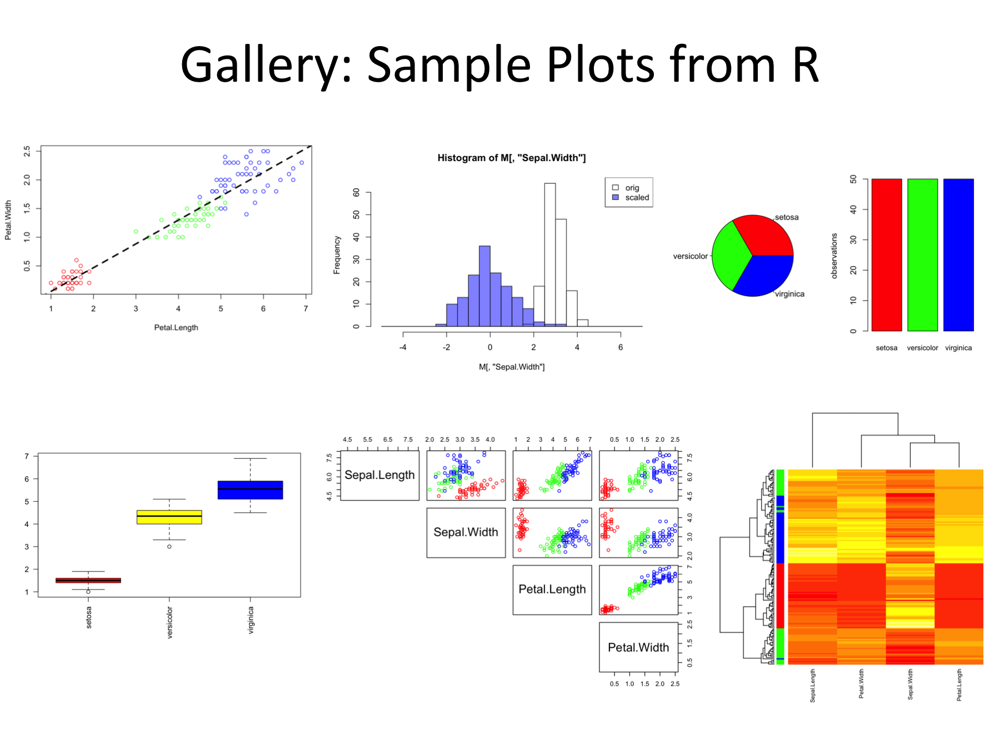

# Overview of R-course

## Block 1: Groundwork
* Intro to RStudio: a GUI for R
* Getting data: I/O
* function structures (understanding output)

## Block 2: Speaking about Data 
* Data Descriptions
* Data Visualization: simple plots and advanced heatmaps
* Data Models: linear models

## Block 3: Open the universe
* installing and using packages
* manipulating data: cleaning, filtering, merging

## Block 4: Advanced topics and case studies
* from interactive use to programming and simple scripts
* data exploration

***

# Goals: 
After the course you will be able to

* understand the basic syntax of R
* find help for more nifty problems
* install and use packages for your specific questions
* see the limitations of EXCEL
* understand the importance of structured data
* understand some bioinformatics jargon
* understand common difficulties in data analysis
* increase the value of your CV
* produce figures such as

[//]: # http://www.r-graph-gallery.com/all-graphs/

# Non-Goals:
This course does *not* teach 

* programming new tools: focus on existing tools
* bioinformatics: BSc course (3 yrs ++)
* NGS analysis: other programs (Linux, Galaxy, deepTools)

***

# Why R ?
* Standard software for data analysis, statistics, and visualization
* free and community support
* many packages available (for data I/O, manipulation, high-end: expression analysis)
* good compromise between flexibility (programming) and box-solutions (packages)
* suitable for very large dataset (filtering, merging)
* interactive and scripting
* not the best solution for everything (e.g. mapping)
* frequent requirement during (bioinformatics) hiring

# First hurdles
* it's a new language: vocabulary & grammar
* case sensitivity: $a \ne A$
* parameter sensitivity
* choices: many ways to say (to program) the same things
* more choices: many (redundant) packages
* computers are stubborn and stupid: they do not think along
* learning curve: steep (but rewarding)

# Start Rstudio